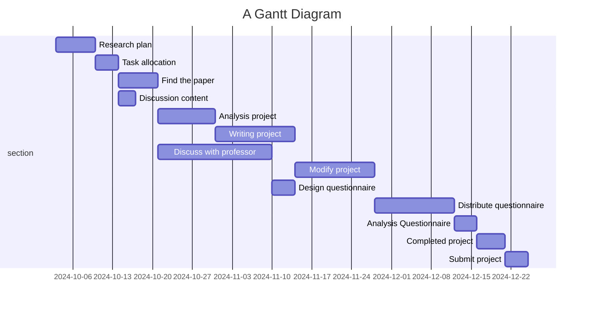
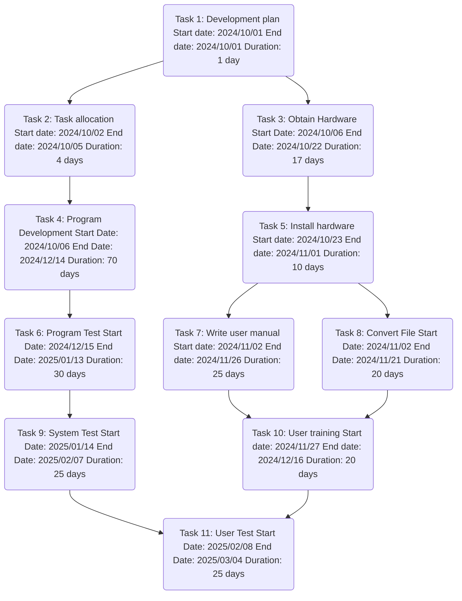

C111118153 羅享福

# Work Breakdown Structure List 
| Task | Description |Time Required (Days) | Prerequisite tasks |
| ---- | ----------- | ------------------- | ------------------ |
| 1 | Develop Plans | 1 | - |
| 2 | Task Allocation | 4 | 1 |
| 3 | Get Hardware | 17 | 1 |
| 4 | Program Development | 70 | 2 |
| 5 | Install Hardware | 10 | 3 |
| 6 | Program Test | 30 | 4 |
| 7 | Writing a User Manual | 25 | 5 |
| 8 | Convert File | 20 | 5 |
| 9 | System Test | 25 | 6 |
| 10 | User Trainning | 20 | 7,8 |
| 11 | User Testing | 25 | 9,10 |

# Gantt Chart


# PERT/CPM Chart


# Critical Path Diagram
```mermaid
graph TD;
 A1[Research Plan] --> A2[Task Assignment];
 A1 --> A3[Get hardware];
 A2 --> A4[Program Development];
 A3 --> A5[Install hardware];
 A4 --> A6[Program Test];
 A5 --> A7[Write user manual];
 A5 --> A8[conversion file];
 A6 --> A9[system test];
 A7 --> A10[User training];
 A8 --> A10;
 A9 --> A11[User Test];
 A10 --> A11;

 style A1 fill:#f9f,stroke:#333,stroke-width:2px;
 style A2 fill:#f9f,stroke:#333,stroke-width:2px;
 style A4 fill:#f9f,stroke:#333,stroke-width:2px;
 style A6 fill:#f9f,stroke:#333,stroke-width:2px;
 style A9 fill:#f9f,stroke:#333,stroke-width:2px;
 style A11 fill:#f9f,stroke:#333,stroke-width:2px;
